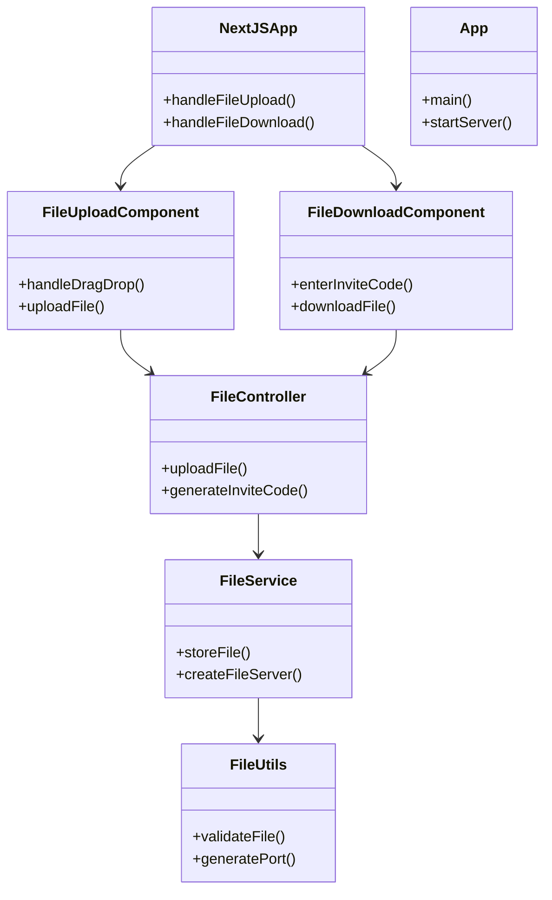

# 🚀 AirBridge – Peer-to-Peer File Sharing App

**AirBridge** is a modern peer-to-peer file sharing app that enables users to securely send and receive files directly using a simple invite-code system. Built with a Java backend and a responsive Next.js frontend.

---

## 📁 Project Structure

```
AirBridge/
├── src/
│   └── main/java/p2p/
│       ├── App.java
│       ├── controller/
│       ├── service/
│       └── utils/
├── ui/
│   └── src/
│       ├── app/
│       └── components/
```

* **Java Backend**: REST API for handling file uploads/downloads, and managing invite codes (port mapping).
* **Next.js Frontend**: Drag-and-drop UI for sending and receiving files.

---

## ✨ Features

* ⚡ Drag-and-drop file uploads
* 🔐 Peer-to-peer file transfer via unique invite codes (port-based)
* 📥 One-click downloads using received codes
* 📱 Responsive, sleek UI
* 🔧 Easy setup with cross-platform support

---

## ✅ Requirements

* **Java 11+**
* **Node.js 18+**
* **Maven**

---

## 🚀 Getting Started

### 🔄 Quick Start (cross-platform)

**Windows:**

```bash
start.bat
```

**Linux/macOS:**

```bash
./start.sh
```

This builds the backend and launches both frontend and server.

---

### 🛠 Manual Setup

#### Backend (Java)

```bash
cd AirBridge
mvn clean package
java -jar target/p2p-1.0-SNAPSHOT.jar
```

> Runs on: `http://localhost:8080`

---

#### Frontend (Next.js)

```bash
cd ui
npm install
npm run dev
```

> Runs on: `http://localhost:3000`

---

## 🧠 How It Works

1. **Upload a File**: File is sent to the backend and assigned an invite code (a unique port).
2. **Share the Code**: Share that invite code with another user.
3. **Download the File**: Receiver enters the code, connects to your device, and downloads the file — directly.

---

## 🏗 Architecture Overview

```
┌──────────────┐    Invite Code    ┌──────────────┐
│  Sender UI   │◄────────────────►│  Receiver UI │
│ (Next.js)    │                  │  (Next.js)   │
└──────────────┘                  └──────────────┘
         │                               ▲
         ▼                               │
     ┌────────┐                    ┌────────┐
     │ Backend│◄──────────────────►│ Backend│
     └────────┘    Port-Based        └────────┘
```

---

## 📊 Low-Level Design (Mermaid UML)



---

## 🔒 Security Notes

Currently this project is designed for demo/local use. For production, consider:

* HTTPS (SSL/TLS)
* User authentication
* File encryption
* Port access hardening
* Upload validation

---

## 🚢 Deployment Options

* Local network
* Docker (backend + frontend + compose)
* Cloud: Railway / Heroku / Vercel / Netlify
* VPS or EC2

---

## 📄 License

MIT License – © 2025 [Ratnakar Yadav](https://github.com/ratn7921)
